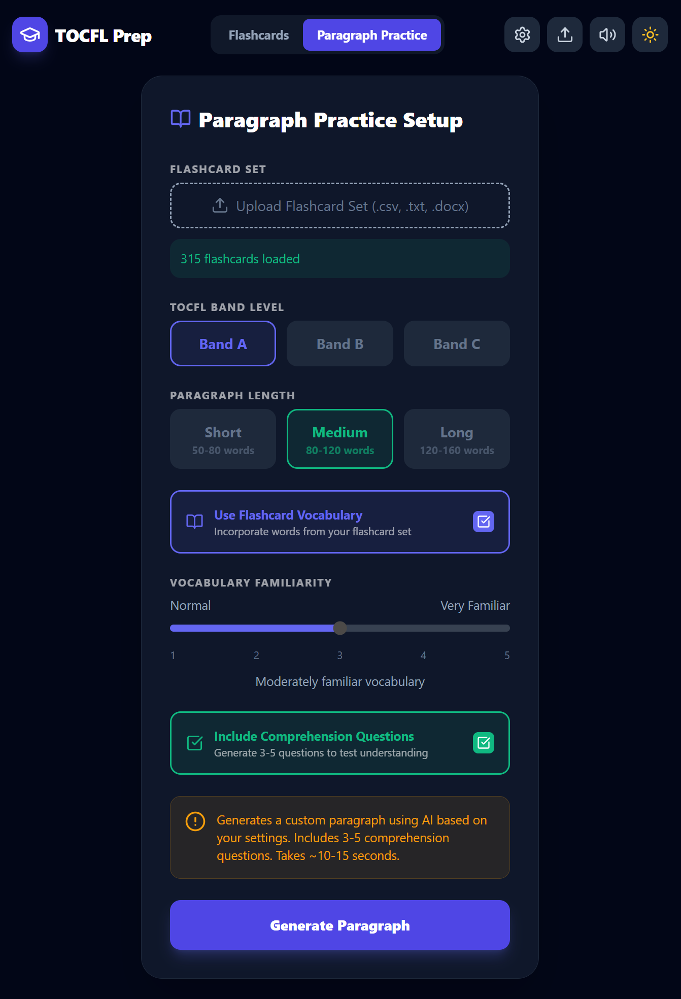
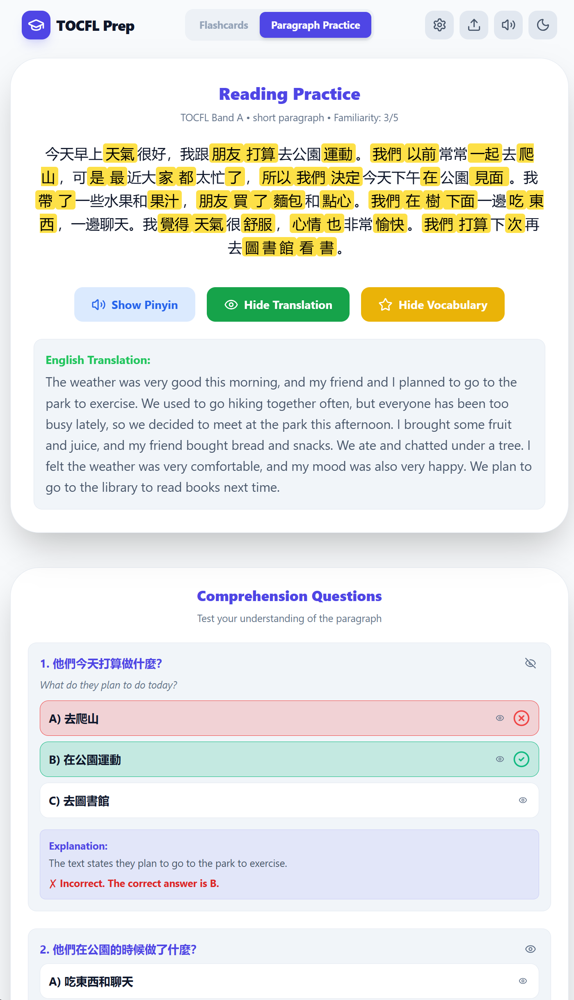
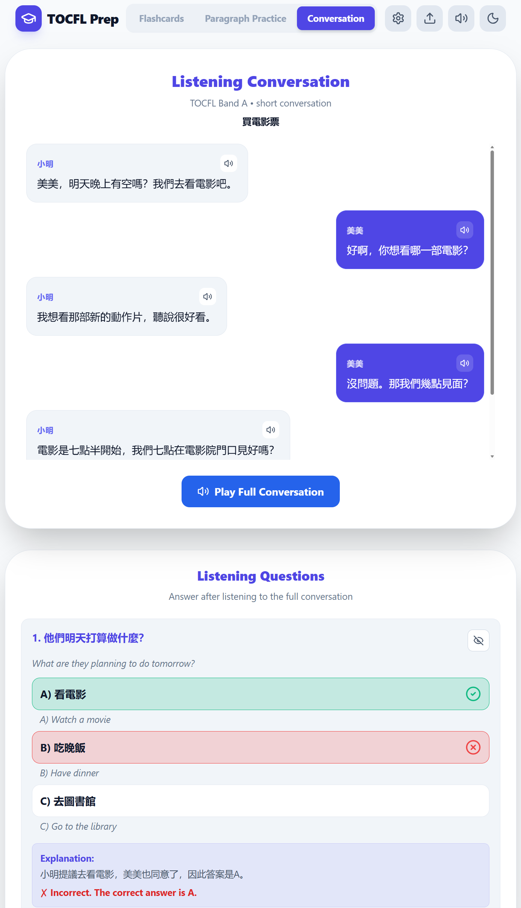

# TOCFL FLASHCARD APP


# Paragraph Practice Mode

Generate your own tocfl practice paragraph based on your difficulty level. You can even add your own flashcards to make the paragraph more familiar and focused on your practice set! 




# Conversation Practice Mode

Generate your own tocfl listening practice conversation based on your difficulty level. You can even add your own flashcards to make the conversation more familiar and focused on your practice set! 


<img width="1080" height="1920" alt="image" src="src/assets/Demo-images/tocfl-prep-app-convo-practice-2.png" 


## Features

- **Flashcard Drill** — score-tracked sessions with a 10-second bonus window, shuffle, and keyboard shortcuts
- **Mix Decks** — select multiple saved decks in the Library and combine them into a new shuffled deck tagged `[Mixed]`
- **Custom Word Review** — after any session, open *Select Custom Words* to cherry-pick individual cards by status (correct / wrong / missed / unvisited) and start a targeted review
- **Paragraph Practice** — AI-generated TOCFL reading passages with pinyin, translation, and optional comprehension questions
- **Conversation Practice** — AI-generated listening transcripts with per-turn audio playback and questions
- **Cloud Library** — save decks, paragraphs, and conversations to the backend; progress is auto-saved on every card advance
- **Offline Mode** — disables all AI/network features so you can drill saved content without a connection

## Stack

- React 19 + Vite 7 + Tailwind CSS
- Node.js + Express backend (port 3001) with SQLite (`server/tocfl.db`)
- JWT authentication (30-day tokens)
- Google Gemini API for AI generation

## Getting Started

```bash
npm install
npm run dev   # starts Vite (5173) + Express (3001) together
```

Set `VITE_GEMINI_API_KEY` in `.env.local` or enter your key in the Settings modal.
